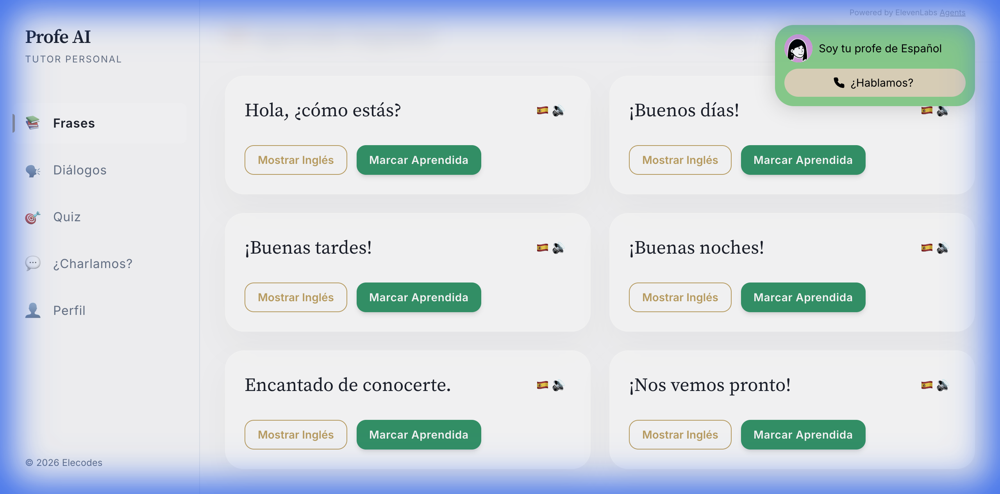
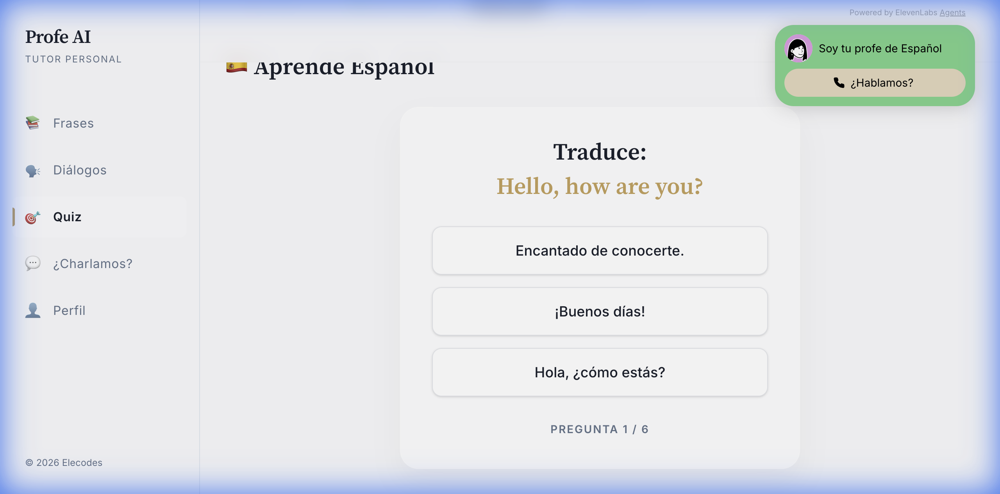
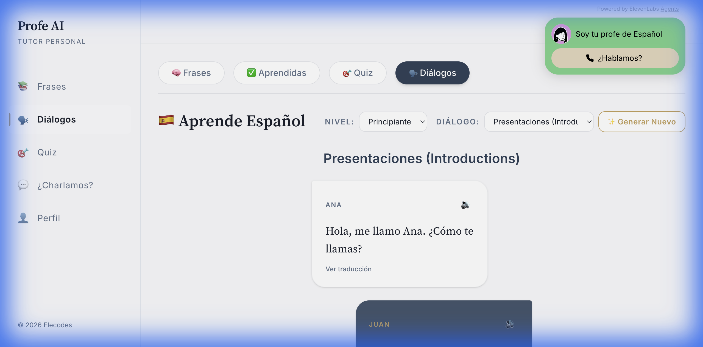
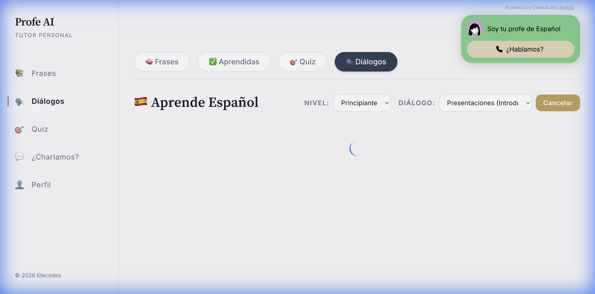
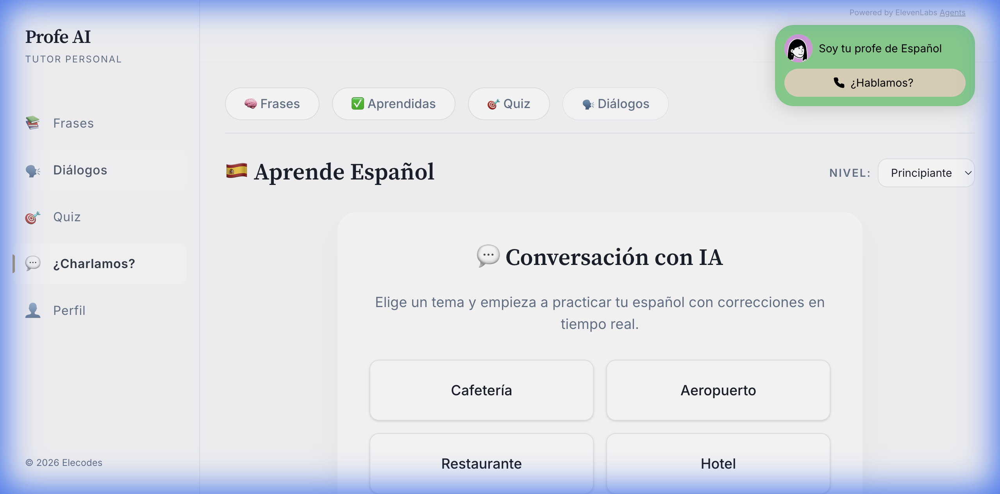
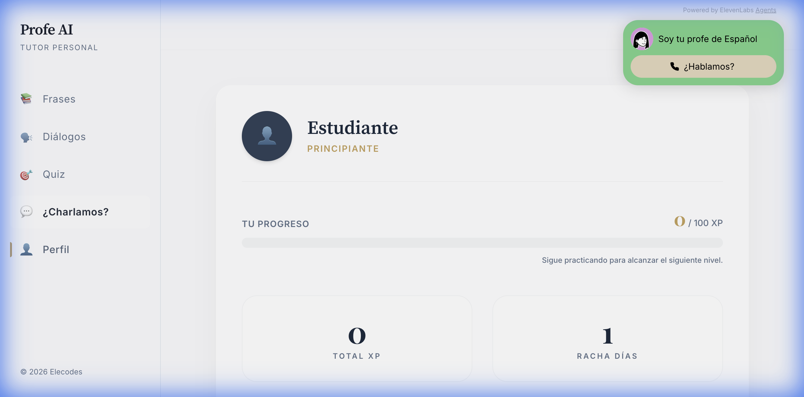

# 🇪🇸 Profe AI - Tu Tutor de Español con IA
> [Read this document in English 🇺🇸](README_en.md)

Profe AI es una aplicación web interactiva diseñada para ayudar a estudiantes a aprender español mediante lecciones estructuradas, práctica de pronunciación (TTS), cuestionarios y conversaciones dinámicas impulsadas por Inteligencia Artificial.

🚀 **Prueba la aplicación aquí: [profeai.onrender.com](https://profeai.onrender.com/)**


### ✨ Características Principales


| Estudio (Frases) | Evaluación (Quiz) | Diálogos AI |
| :---: | :---: | :---: |
|  |  |  |
| **Generador AI** | **Chat Interactivo** | **Perfil Estudiante** |
|  |  |  |

*   **Tutoría con IA:** Conversación fluida y natural impulsada por Google Gemini.
*   **📚 Lecciones Dinámicas:** Contenido gestionado en **Firestore** que permite actualizaciones sin redesepliegue.
*   **🗣️ Texto a Voz (TTS) Premium:** Prioriza **Amazon Polly** y **ElevenLabs** para una voz natural, con fallback automático a Google Cloud y Web Speech API.
*   **🤖 Tutor de IA (Roleplay):** Practica situaciones reales (ej. "En el restaurante") con un tutor de IA que se adapta a tu nivel.
*   **👨‍⚕️ Doctor Gramática:** Análisis gramatical con validación robusta (**Zod**).
*   **🔄 Contenido Fresco Automático:** Script robusto (Github Actions) que genera nuevas frases y quizzes cada 2 semanas usando **Gemini (free tier)**, con estrategias de fallback y backup local para restauración.
*   **🔒 Seguridad Reforzada:** Protección con **Helmet.js** (CSP), **HTTPS** automático (Let's Encrypt), y gestión de vulnerabilidades vía Snyk con actualizaciones de dependencias y **overrides** a nivel monorepo.
*   **💬 Modo Conversación Híbrido:** Chat de texto y voz fluido.
*   **✅ Seguimiento de Progreso:** Visualiza tu avance por semanas y niveles (con opción de reinicio completo).
*   **♿ Accesibilidad y Heurística (UX):**
    *   **Navegación por Teclado:** Uso completo sin ratón (Tab, Enter, Escape).
    *   **Lectores de Pantalla:** Etiquetas ARIA descriptivas en todos los botones.
    *   **Indicadores de Estado:** Animaciones de "Pensando..." durante la generación de IA para reducir la espera percibida.
*   **Contraste de Alto Nivel:** Uso de `amber-300` como estándar mínimo para resaltes sobre fondos oscuros, garantizando legibilidad.
*   **⚡ Rendimiento Avanzado:**
    *   **Lazy Loading:** Carga progresiva de páginas para un inicio instantáneo.
    *   **AI Model Reporting:** El sistema informa en consola exactamente qué modelo está respondiendo (ej: "Gemini 2.5 Flash Lite").
    *   **Estrategia Accionable:** Uso de **Gemini 2.5 Flash Lite** con **Sequential Fallback** a Gemini 2.5 Flash y Gemini 1.5 para maximizar la disponibilidad y ahorrar cuota.
*   **📱 Diseño Mobile-First:** Interfaz totalmente adaptativa con navegación optimizada (menú lateral) y visuales centrados para una experiencia premium en dispositivos móviles.
*   **🎙️ Widget de IA Mejorado:** Widget de ElevenLabs perfectamente integrado en el header, optimizado para no obstruir el contenido y garantizando visibilidad total durante la conversación.
*   **🔐 Autenticación Profesional (Sincronizada):**
    *   **Estado Global (Unified Auth):** Implementado con Context API para asegurar una sesión única en toda la app.
    *   **Recuérdame:** Soporte real para persistencia de sesión (`LOCAL` vs `SESSION`).
    *   **Recuperación de Contraseña:** Flujo completo de recuperación vía email.
    *   **Login con Google:** Acceso rápido y seguro con un solo clic.
    *   **Validación Estricta:** Registro seguro y detección inteligente de cuentas existentes.

## 🛠️ Tecnologías y Estructura (Monorepo)

El proyecto está organizado como un **npm workspace** para separar claramente las responsabilidades:

- **Frontend (`/frontend`)**: React, Vite, Tailwind CSS.
- **Backend (`/backend`)**: Node.js, Express, **Helmet.js**, Genkit.

### Integraciones Externas
- **Base de Datos**: Firebase Firestore & Authentication.
- **IA & Servicios**: LangChain, **Genkit**, OpenAI, Gemini 2.5, Amazon Polly, Google Cloud TTS, ElevenLabs, **Tavily**.
- **Calidad**: Sentry, Playwright, Vitest, Lighthouse.

## 🚀 Instalación y Uso

1.  **Instalar dependencias (desde la raíz):**
    ```bash
    npm install
    ```

2.  **Configurar variables de entorno:**
    Crea un archivo `.env` en la raíz (ver `.env.example`).

3.  **Ejecución con Scripts de Workspace:**
    - `npm run dev`: Lanza frontend y backend simultáneamente.
    - `npm run frontend:dev`: Inicia solo el cliente web.
    - `npm run frontend:build`: Compila la aplicación para producción.
    - `npm run frontend:preview`: Sirve la versión compilada en `http://localhost:3001` (útil para E2E).
    - `npm run backend:dev`: Inicia solo el servidor API.

4.  **Cargar Contenido (Seed):**
    Sube las lecciones iniciales desde los archivos JSON locales a Firestore. 
    > [!IMPORTANT]
    > Requiere un archivo `service-account.json` en la raíz que pertenezca al mismo proyecto configurado en el frontend.
    ```bash
    # Sincroniza lecciones locales a Firestore
    node backend/scripts/seedLessons.js
    ```

5.  **Actualizar Contenido con IA (Opcional):**
    Para generar contenido fresco usando Gemini:
    ```bash
    npx tsx backend/scripts/refresh-content.ts
    ```

## ▶️ Ejecución

### Desarrollo Local (HTTP)
```bash
npm run dev
```
Accede a `http://localhost:5173`.

### Desarrollo Local Seguro (HTTPS)
Para probar características que requieren SSL (como el micrófono en algunos navegadores):
1.  Generar certificados:
    ```bash
    ./init-local-https.sh
    ```
2.  Acceder a `https://localhost`.

### Producción (Render / Docker)
El proyecto está optimizado para desplegarse como un **Web Service** en **Render** usando Docker:

1.  **Repo**: Conecta tu repositorio de GitHub a Render.
2.  **Runtime**: Selecciona **Docker**.
3.  **Dockerfile Path**: `Dockerfile` (en la raíz).
4.  **Build Context**: `.` (raíz del proyecto).
5.  **Docker unificado**: Un único `Dockerfile` en la raíz que compila el frontend (React/Vite) y lo sirve estáticamente desde el backend (Express/Node.js). El Dockerfile incorpora hardening mediante `apk upgrade` y actualizaciones de `npm` para mitigar vulnerabilidades base.
6.  **Inyección de variables en Build-time**: Debido a que Vite embebe las variables `VITE_*` durante el empaquetado, el Dockerfile crea un archivo `.env` dinámico usando `ARG` pasados por Render.
7.  **Gestión de Transitorias**: Uso de `overrides` en el `package.json` raíz para forzar versiones seguras de dependencias indirectas (ej: `qs`) identificadas por Snyk.
8.  **Optimización de arranque**: Uso de `tsx` en el backend para ejecutar directamente TypeScript en producción, simplificando el flujo de compilación.
9.  **Seguridad Adaptativa**: Configuración de Helmet ajustada para permitir WebSockets de ElevenLabs y Popups de Firebase Auth (`Cross-Origin-Opener-Policy`).
10. **Variables**: Configura todas las claves de API como variables de entorno. 
    > [!IMPORTANT]
    > Las variables `VITE_*` deben pasarse como **Build-time environment variables** en Render (o mediante el Dashboard de Secretos), ya que Vite las embebe durante el paso de compilación (`npm run build`). Las variables de backend (ej: `FIREBASE_SERVICE_ACCOUNT`) pueden ser de **Runtime**.
11. **Firebase**: Recuerda añadir el dominio de Render a la lista de **Dominios Autorizados** en la consola de Firebase Authentication.

## 🧪 Tests y Calidad

*   **Unitarios:** `npm test`
*   **E2E:** `npm run test:e2e` (Ejecuta tests con Playwright. Por defecto intenta conectar a `http://localhost:3001`. Asegúrate de tener el servidor de preview o Docker corriendo si pruebas localmente).
*   **Linting:** `npm run lint`
*   **Seguridad:** `npm run test:security` (Snyk)
*   **Documentación:** `npm run doc` (Genera documentación técnica con TypeDoc en `docs/api`)
### 🛡️ Estrategia de Testing "Honest Coverage"

Este proyecto sigue una estrategia de calidad pragmática:
*   **Servicios de Dominio (100%)**: La lógica de negocio pura (`src/services/`) se mantiene con cobertura total.
*   **Cobertura Global (~46%)**: Enfocada en los flujos principales. No se sobre-testean hooks complejos de navegador (como `useTTS`) para evitar fragilidad en los tests.
*   **UI & Storybook**: Los componentes visuales se verifican vía Storybook y sus tests de interacción.
*   **Verificación Automática**: Ejecuta `npm test` antes de cada push para asegurar que no se introducen regresiones.

## 🤝 Contribuciones

¡Las contribuciones son bienvenidas! Para mantener la calidad del proyecto, hemos automatizado parte del proceso:

1.  **Issues**: Al abrir un error o propuesta, utiliza nuestras plantillas para proporcionar toda la información necesaria.
2.  **Pull Requests**: Asegúrate de completar la lista de verificación (checklist) que aparecerá automáticamente en la descripción de tu PR.
3.  **Guía de Estilo**: Revisa nuestro [CONTRIBUTING.md](CONTRIBUTING.md) y sigue los estándares de código existentes.

Un bot de bienvenida te guiará una vez que abras tu primera contribución.

## 🏛️ Decisiones Arquitectónicas (ADR)
Para entender mejor por qué tomamos ciertas decisiones técnicas, puedes consultar nuestros registros de diseño:

*   [ADR 001: Adopción de Storybook](./docs/ADR/001-adopcion-storybook-development.md)
*   [ADR 002: Optimización de Rendimiento](./docs/ADR/002-performance-latency-optimization.md)
*   [ADR 003: Estrategia de Testing](./docs/ADR/003-testing-strategy.md)
*   [ADR 011: Variables de Entorno en Build-time](./docs/ADR/011-playwright-build-env-vars.md)
*   [ADR 012: Onboarding de Contribuidores Automatizado](./docs/ADR/012-automated-contributor-onboarding.md)
*   [ADR 013: Security Hardening and Dialogue UI Refinement](./docs/adr/013-security-hardening-ui-refinement.md)
*   [ADR 014: Hardening Firebase Config and Dependencies](./docs/adr/014-hardening-firebase-config-and-deps.md)

## 📄 Licencia

Este proyecto está bajo la Licencia MIT.
