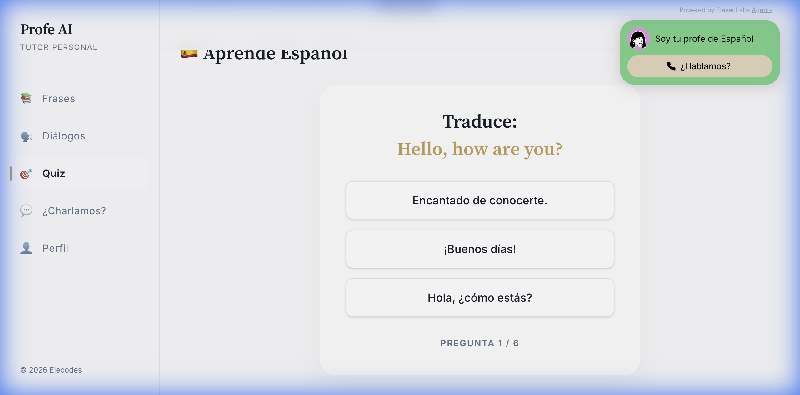
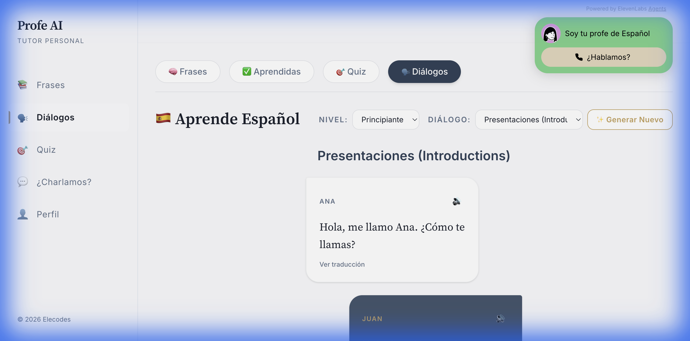
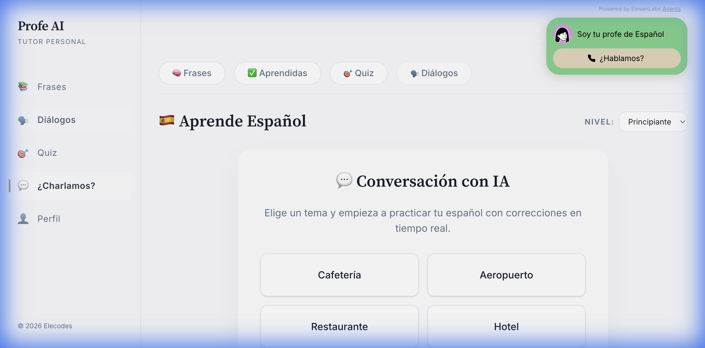
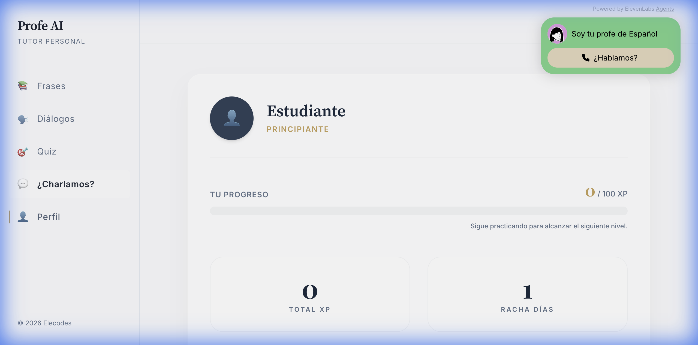

# 🇺🇸 Profe AI - Your AI Spanish Tutor

Profe AI is an interactive web application designed to help students learn Spanish through structured lessons, pronunciation practice (TTS), quizzes, and dynamic conversations powered by Artificial Intelligence.


| Study (Phrases) | Evaluation (Quiz) | AI Dialogues |
| :---: | :---: | :---: |
|  |  |  |
| **AI Generator** | **Interactive Chat** | **Student Profile** |
|  |  |  |

## ✨ Key Features

*   **AI Tutoring:** Fluid and natural conversation powered by Google Gemini.
*   **📚 Dynamic Lessons:** Content managed in **Firestore**, allowing updates without redeployment.
*   **🗣️ Premium Text-to-Speech (TTS):** Prioritizes **Amazon Polly** and **ElevenLabs** for natural-sounding voice, with automatic fallback to Google Cloud and Web Speech API.
*   **🤖 AI Tutor (Roleplay):** Practice real-life situations (e.g., "At the restaurant") with an AI tutor that adapts to your proficiency level.
*   **👨‍⚕️ Grammar Doctor:** Grammar analysis with robust validation (**Zod**).
*   **🔒 Enhanced Security:** Protection with **Helmet.js** (CSP), automatic **HTTPS** (Let's Encrypt), and vulnerability management via Snyk with selective dependency updates and monorepo-level **overrides**.
*   **💬 Hybrid Conversation Mode:** Fluid voice and text chat.
*   **✅ Progress Tracking:** Visualize your progress by weeks and levels (with full reset option).
*   **♿ Accessibility & UX Heuristics:**
    *   **Keyboard Navigation:** Full mouseless control (Tab, Enter, Escape).
    *   **Screen Readers:** Descriptive ARIA labels on all buttons.
    *   **Status Indicators:** "Thinking..." animations during AI generation to improve perceived performance.
*   **⚡ Advanced Performance:**
    *   **Lazy Loading:** Progressive page loading for instant startup.
    *   **AI Model Reporting:** System logs exactly which AI model is responding to the console (e.g., "Gemini 2.5 Flash Lite").
    *   **Sequential Fallback:** Prioritizes **Gemini 2.5 Flash Lite** and **Gemini 2.5 Flash** with automatic fallback to stable models to ensure availability and save cost.
*   **📱 Mobile-First Design:** Fully responsive interface with optimized navigation (sidebar) and centered visuals for a premium mobile experience.
*   **🎙️ Optimized AI Widget:** ElevenLabs widget perfectly integrated into the header, optimized to avoid obstructing content and ensuring full visibility during conversation.
*   **🔐 Professional Authentication (Unified):**
    *   **Global Auth Context:** Single source of truth for the user session across the app.
    *   **Remember Me:** Real support for session persistence (`LOCAL` vs `SESSION`).
    *   **Password Reset:** Functional email recovery flow.
    *   **Google Login:** Quick and secure one-click access.
    *   **Strict Validation:** Secure registration and smart existing account detection.

## 🛠️ Technologies & Structure (Monorepo)

The project is organized as an **npm workspace** to clearly separate concerns:

- **Frontend (`/frontend`)**: React, Vite, Tailwind CSS.
- **Backend (`/backend`)**: Node.js, Express, **Helmet.js**, Genkit.

### External Integrations
- **Database**: Firebase Firestore & Authentication.
- **AI & Services**: LangChain, **Genkit**, OpenAI, Gemini 2.5, Amazon Polly, Google Cloud TTS, ElevenLabs, **Tavily**.

## 🚀 Installation & Usage

1.  **Install dependencies (from root):**
    ```bash
    npm install
    ```

2.  **Configure Environment Variables:**
    Create a `.env` file in the root (see `.env.example`).

3.  **Run using Workspace Scripts:**
    - `npm run dev`: Starts both frontend and backend.
    - `npm run frontend:dev`: Starts only the web frontend.
    - `npm run backend:dev`: Starts only the API backend.

4.  **Load Content (Seed):**
    Upload initial lessons to Firestore:
    ```bash
    # Running from root using workspace delegate
    npm run backend:seed
    ```

## 🧪 Testing and Quality

*   **Linting:** `npm run lint`
*   **Security:** `npm run test:security` (Snyk)
*   **Accessibility:** `npm run ci:a11y -w frontend` (WCAG AA compliance via pa11y-ci)
*   **Documentation:** `npm run doc` (Generates TypeDoc in `docs/api`)

### 🛡️ "Honest Coverage" Testing Strategy

This project follows a pragmatic quality strategy:
*   **Domain Services (100%)**: Core business logic (`src/services/`) is fully covered.
*   **Global Coverage (~46%)**: Focused on critical flows. We avoid over-testing complex browser hooks (like `useTTS`) to prevent brittle tests.
*   **UI & Storybook**: Visual components are verified via Storybook interaction tests.
*   **Accessibility (WCAG AA)**: Automated testing ensures color contrast and semantic HTML compliance.
*   **Automatic Verification**: Run `npm test` before pushing to ensure no regressions.

## 📄 License

This project is licensed under the MIT License.
